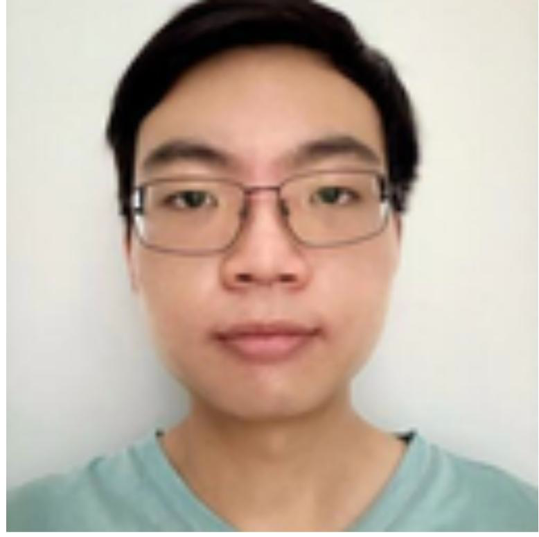
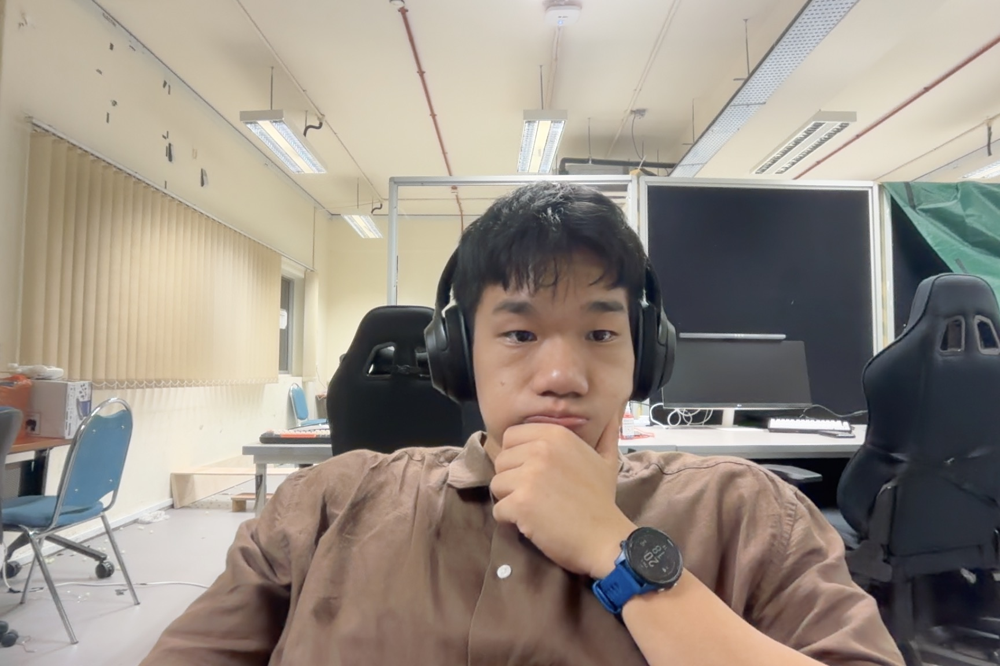
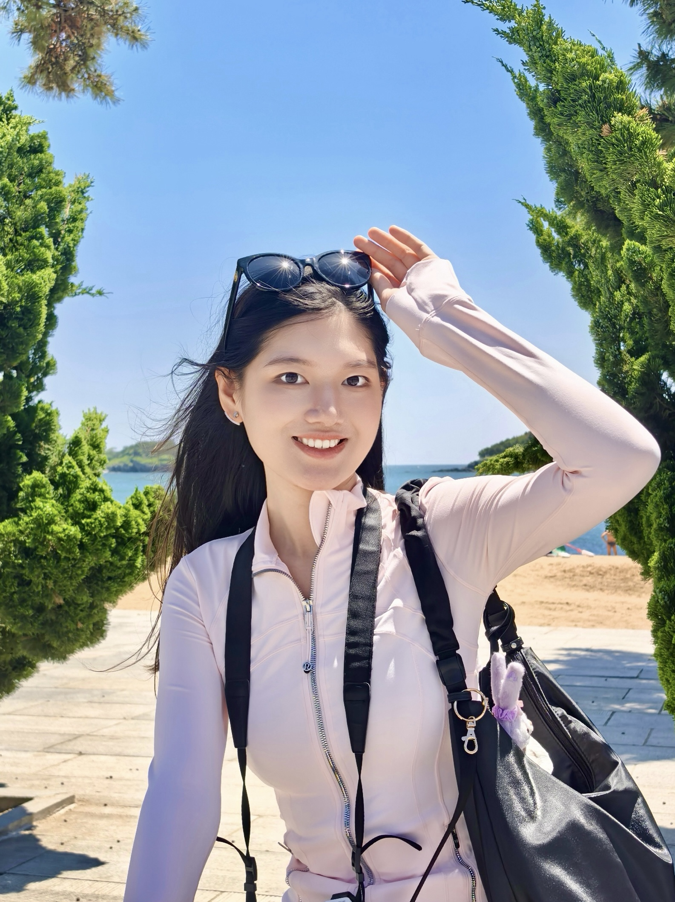
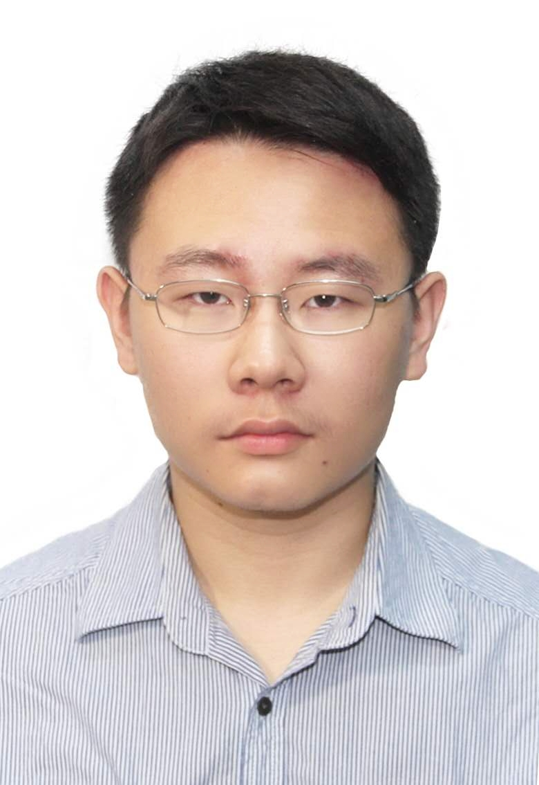
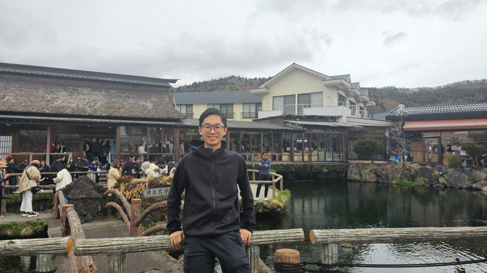

We are a team based in the [School of Computing, National University of Singapore](https://www.comp.nus.edu.sg).

## Project team

### Henry Lee

[[github](https://github.com/henrlly)]

* Role: Developer
* Responsibilities: Develop features, perform quality assurance and testing,
  and fix bugs

### Alexander Seah

[[homepage](https://robotsbybed.properrobotics.org)]
[[github](https://github.com/bedminer1)]

- Role: Developer
- Responsibilities: Backend Engineer

### Zhaohan Li

[[github](https://github.com/AmyLiiiii)]

- Role: Developer
- Responsibilities: Develop features, perform quality assurance and testing, and fix bugs

### Mao Yinbo

[[github](http://github.com/mao455)]

- Role: Developer
- Responsibilities: Develop features, perform quality assurance and testing, and fix bugs

### Vincent Lim

[[github](https://github.com/ViincentLim)]

- Role: Developer
- Responsibilities: Develop features, perform quality assurance and testing, and fix bugs
