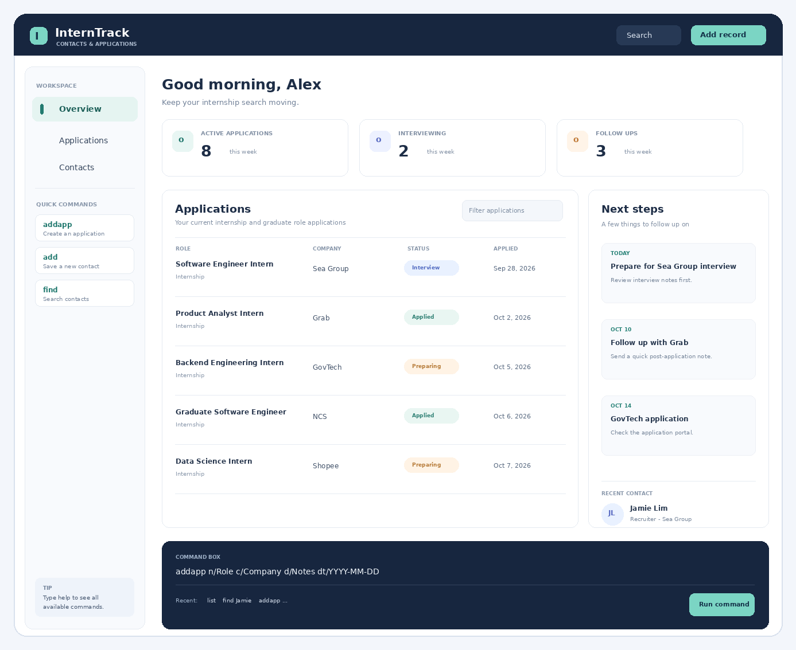

**InternTrack helps university Computing students keep internship applications and professional contacts in one place.** It combines a desktop interface with a command line interface (CLI) for users who prefer keyboard-driven workflows.

* To learn how to use InternTrack, start with the [_Quick Start_ section of the **User Guide**](UserGuide.html#quick-start).
* To learn how the project is structured, see the [**Developer Guide**](DeveloperGuide.html).

InternTrack stores contact records and internship or graduate role application details locally. It does not search for vacancies or submit applications on a user's behalf.

**Acknowledgements**

This project is based on the AddressBook-Level3 project created by the [SE-EDU initiative](https://se-education.org). It uses [JavaFX](https://openjfx.io/), [Jackson](https://github.com/FasterXML/jackson), and [JUnit 5](https://junit.org/junit5/).
